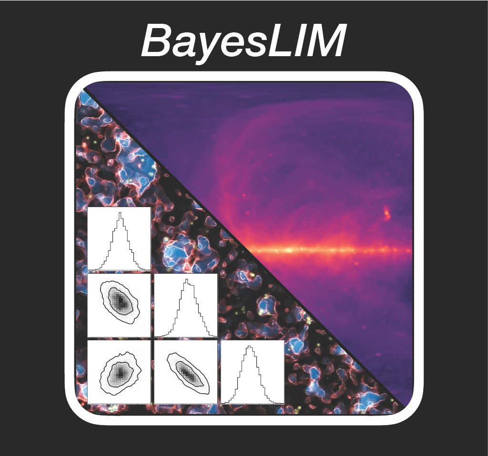
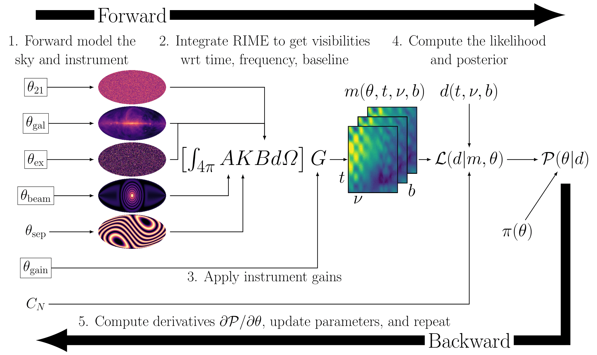

# BayesLIM
---
<h3>Differentiable Bayesian Forward Modeling for LIM Cosmology</h3>

BayesLIM is a toolbox for performing end-to-end analysis of line intensity mapping (LIM) datasets in a differentiable, Bayesian forward model framework.
It is built on the widely used PyTorch library, which provides easy access to GPU acceleration.
Currently, it is tuned for 21 cm intensity mapping, but future versions will support multi-spectral line analyses.

Separately, BayesLIM is a 

* fast and accurate LIM telescope forward model
* generalized calibration solver
* interferometric sky imager
* signal parameterization and modeling tool
* posterior density estimator

Together, these functionalities enable BayesLIM to constrain the joint posterior of a cosmological LIM signal in addition to the complex and often poorly constrained foreground and instrumental response.
The flowchart below, for example, summarizes the BayesLIM forward modeling process for a 21 cm intensity mapping experiment.

See the documentation at <https://bayeslim.readthedocs.io> for more details.
For installation, see <https://bayeslim.readthedocs.io/install.html>.

## Acknowledgements
Kern 2025 in prep.
 
Reionization simulation graphic: Alvarez et al. 2009 ApJ 703L.167A
